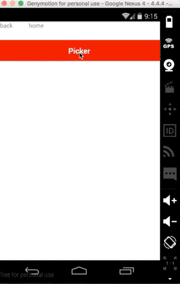
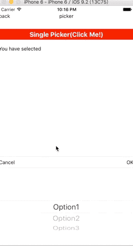

# react-native-picker
Cross platform picker for IOS and Android.
It is based on PickerIOS for IOS while [react-native-wheel](https://github.com/shexiaoheng/react-native-wheel) for android.

 

# Guide
## npm install
    $ npm i mkp-react-native-picker --save
## Update Gradle Settings
    // file: android/settings.gradle
    ...
    include ':react-native-wheel'
    project(':react-native-wheel').projectDir = new File(rootProject.projectDir, '../node_modules/react-native-wheel/android')
## Update app Gradle Build
    // file: android/app/build.gradle
    ...
    
    dependencies {
      ...
      compile project(':react-native-wheel')
    }
## Register React Package
    // file: android/src/main/java/com.xx/MainApplication.java
    ...
    
    private final ReactNativeHost mReactNativeHost = new ReactNativeHost(this) {
        @Override
            protected boolean getUseDeveloperSupport() {
                return BuildConfig.DEBUG;
            }
    
            @Override
            protected List<ReactPackage> getPackages() {
                return Arrays.<ReactPackage>asList(
                    new MainReactPackage(),
                    new WheelPackage()          // Added there
                );
            }
        };
## Use
    import React ,{Component}from 'react';
    import {
        StyleSheet,
        Text,
        View,
        TouchableOpacity,
        Platform
    } from 'react-native';
    
    import SinglePicker from 'mkp-react-native-picker';
    
    const viewStyles = StyleSheet.create({
        main: {
            ...Platform.select({
                android: {
                    marginTop: 44
                },
                ios: {
                    marginTop: 64
                }
            }),
            flex: 1,
            backgroundColor: '#f5f5f5'
        }
    });
    
    const options = [{
        key: 1,
        value: "Option1"
    }, {
        key: 2,
        value: "Option2"
    }, {
        key: 3,
        value: "Option3"
    }];
    
    export default class Picker extends Component {
        constructor(props) {
            super(props);
            this.state = {
                selected: ''
            }
        }
    
        render() {
            return <View style={viewStyles.main}>
                <TouchableOpacity
                    style={{height:30,flexDirection:'row',justifyContent:'center',alignItems:'center',backgroundColor:'red'}}
                    onPress={()=>{
                        this.singlePicker.show();
                    }}>
                    <Text style={{fontSize:18,color:'white',fontWeight:'bold'}}>Single Picker(Click Me!)</Text>
                </TouchableOpacity>
    
                <View style={{height:50,justifyContent:'center'}}><Text>You have
                    selected {this.state.selected}</Text></View>
    
                <SinglePicker
                    lang="en-US"
                    ref={ref=>this.singlePicker=ref}
                    onConfirm={(option)=>{
                        //this.setState({selected:option.value})
                    }}
                    onSelect={(option)=>{
                        this.setState({selected:option.value})
                    }}
                    options={options}
                >
    
                </SinglePicker>
            </View>
        }
    }
    
# Documentation

## Properties
Key | Type | Required | Default | Description
--- | ---- | -------- | ------- | -----------
options | array | yes | | must be an array of key-value pairs,like {key:1,value:'option'}
lang | string | no | 'zh-CN' | enums:'zh-CN','en-US',indicate the language of the text in buttons
style | object | no | {backgroundColor: "white"} | 
defaultSelectedValue | any | no |  | key of each option,if undefined, the first option will be selected
onConfirm | function | no | | option that be selected as the parameter
onSelect | function | no | | option that be selected as the parameter
onCancel | function | no | |     

## Methods
Name | Description
---- | -----------
show | show the Picker
hide | hide the Picker